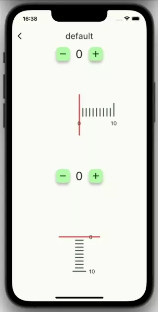

# ruler_scale_picker

[![pub package][pub_badge]][pub_badge_link]
[![package publisher][publisher_badge]][publisher_badge_link]
[![style][style_badge]][style_link]
[![license][license_badge]][license_link]

A highly customisable, scrollable widget in a ruler-like style from which you can select values.



## Features

* Customisable widgets
* Platform-specific physics (Android -> pinch, iOS -> bounce).
* Values on the ruler snap into place
* Horizontal and vertical orientation possible
* Customisable values through an extensible controller/interface
* Controllable and listenable through a controller
* Right-to-left-support
* Haptic feedback on iOS

## Usage

### Depend on it

```yaml
dependencies:
  ruler_scale_picker: ^0.1.0
 ```

### Import it
``` dart
import 'package:ruler_scale_picker/ruler_scale_picker.dart';
```

### Example

``` dart
NumericRulerScalePicker()
```

## Possibilities 

### Custom options

``` dart
NumericRulerScalePicker(
    options: RulerScalePickerOptions(
        majorIndicatorInterval: 2,
        indicatorExtend: 70,
    ),
),
```

### Custom widgets

``` dart
NumericRulerScalePicker(
    decreaseButtonBuilder: (context, action) {
        return ElevatedButton(
            onPressed: action,
            child: const Text('-'),
        );
    }
)
```

### Custom controller

``` dart
NumericRulerScalePicker(
    controller: NumericRulerScalePickerController(),
)
```

[pub_badge]: https://img.shields.io/pub/v/ruler_scale_picker.svg
[pub_badge_link]: https://pub.dartlang.org/packages/ruler_scale_picker
[publisher_badge]: https://img.shields.io/pub/publisher/ruler_scale_picker.svg
[publisher_badge_link]: https://pub.dev/publishers/cosee.biz/packages
[license_badge]: https://img.shields.io/github/license/cosee/cosee_lints
[license_link]: https://github.com/cosee/ruler_scale_picker/blob/main/LICENSE
[style_badge]: https://img.shields.io/badge/style-cosee__lints-brightgreen
[style_link]: https://pub.dev/packages/cosee_lints
