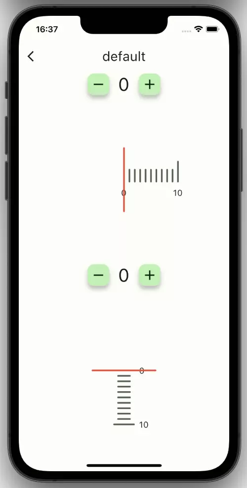
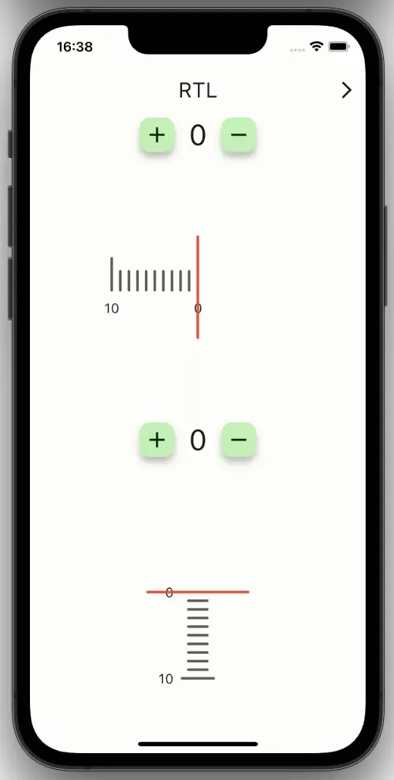
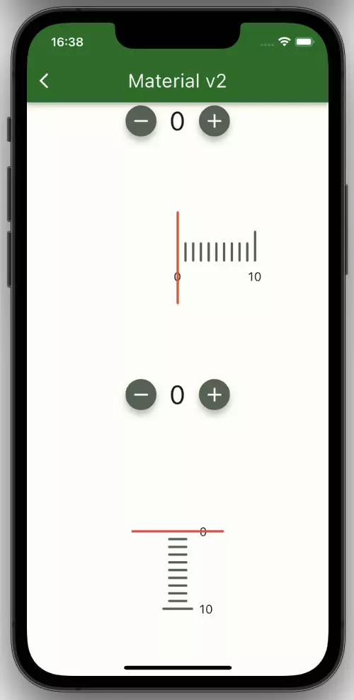
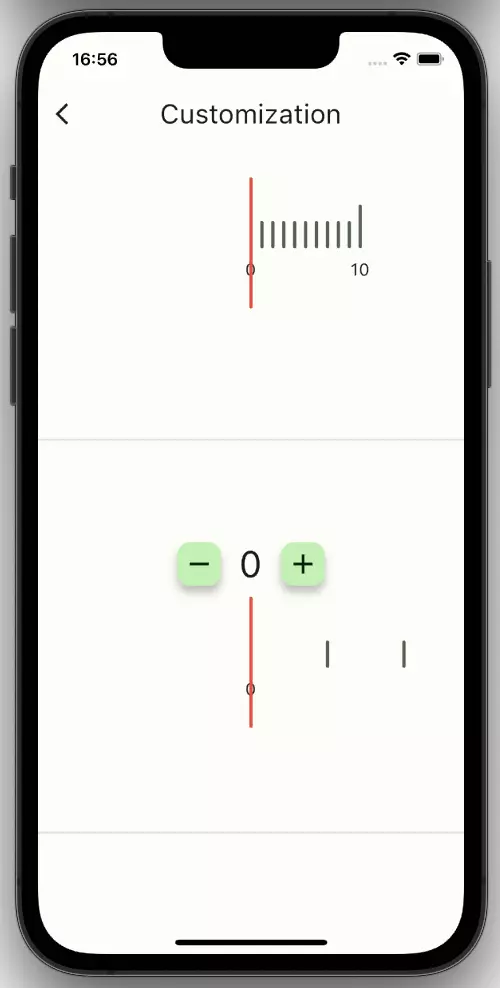
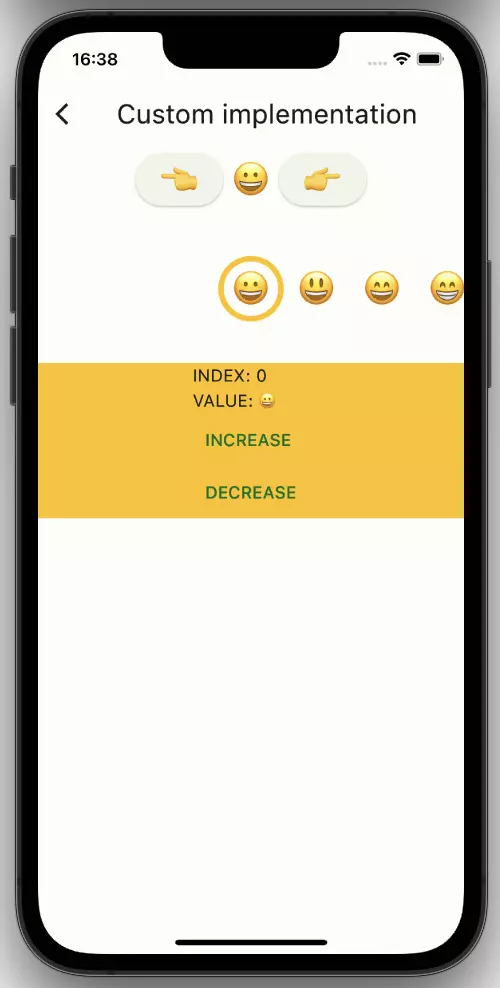

## Examples for the use of alphabet_list_view.

- ### Default ([Source](lib/pages/default.dart))
  

- ### RTL ([Source](lib/pages/rtl.dart))
  

- ### Material v2 ([Source](lib/pages/material2.dart))
  

- ### Customization ([Source](lib/pages/customization.dart))
  

- ### Custom implementation ([Source](lib/pages/custom.dart))
  
